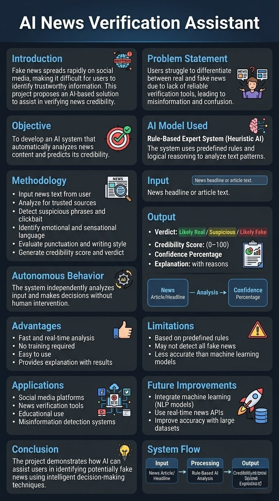

# AI News Verification Assistant

This project is an AI-based application that analyzes news text and predicts whether it is real or fake using rule-based logic.
Presented By: Soumil Yadav RA2411042010033
              Aryan Rakesh Singh RA2411042010025
              Varadhan S RA2411042010031
              Pritwish Kayet RA2411042010038
## Features
- Credibility score
- Fake/real classification
- Explanation with reasons

## Technologies Used
- Python
- Tkinter

## AI Model
Rule-Based Expert System

## How to Run
python main.py

## Poster

